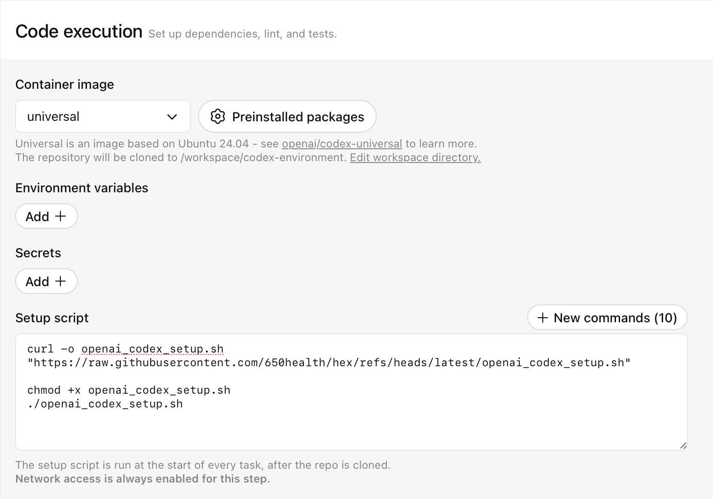

[Upstream README](https://github.com/hexpm/hex)

# Hex patched for OpenAI Codex

Use this fork instead of `hex/hexpm` to have `mix deps.get` work in
[OpenAI Codex Cloud](https://platform.openai.com/docs/codex/overview).

## Usage

Add this to your setup script:

```bash
curl -o openai_codex_setup.sh "https://raw.githubusercontent.com/650health/hex/refs/heads/latest/openai_codex_setup.sh"
chmod +x openai_codex_setup.sh
./openai_codex_setup.sh

mix deps.get
```

This will:

- Download this patched version of hex
- Download rebar3, needed to download erlang packages



## Background

When running code in Codex, one must send requests via the
[proxy server](https://platform.openai.com/docs/codex/overview#internet_access_and_network_proxy).

Running `mix deps.get` fails in the base environment of the container. When run
for the first time, `mix deps.get` uses Erlang/OTP `httpc` module to make get
requests, which has an incompatibility with the Codex proxy server. By default,
it sends an empty `te` header if the caller doesn't supply one.

The fundamental issue is that the Codex proxy returns a 503 if `te` header is
set to `""`.

This patch changes the header to something semantically equivalent
(`deflate;q=0`), which is equivalent to sending nothing.

This issue in `httpc` causes `mix` and `hex` to fail in multiple ways:

- When running `mix` for the first time, if it detects Hex dependencies, it will
  first attempt to download hex package manager (using a httpc get request).
  This will fail due to the httpc issue above.
- It will also attempt to download rebar3, also using a httpc get requests, also
  failing.
- Hex also downloads packages with a httpc get request, which would also fail
  without this patch.

The first two issues are in `mix`, which `openai_codex_setup.sh` is able to get
around by downloading this patched version of `hex` using `git` and `rebar3`
using `curl` and installing manually. The latter issue is in `hex`, which the
patch in this repo corrects. This is not a patch for `mix`, so any other HTTP
GET requests made by `mix` may still fail since
[it also uses `httpc` get requests](https://github.com/elixir-lang/elixir/blob/main/lib/mix/lib/mix/utils.ex#L819).

In the meantime, I have opened an issue in Erlang/OTP to fix the root cause in
httpc: <https://github.com/erlang/otp/issues/10065>.
